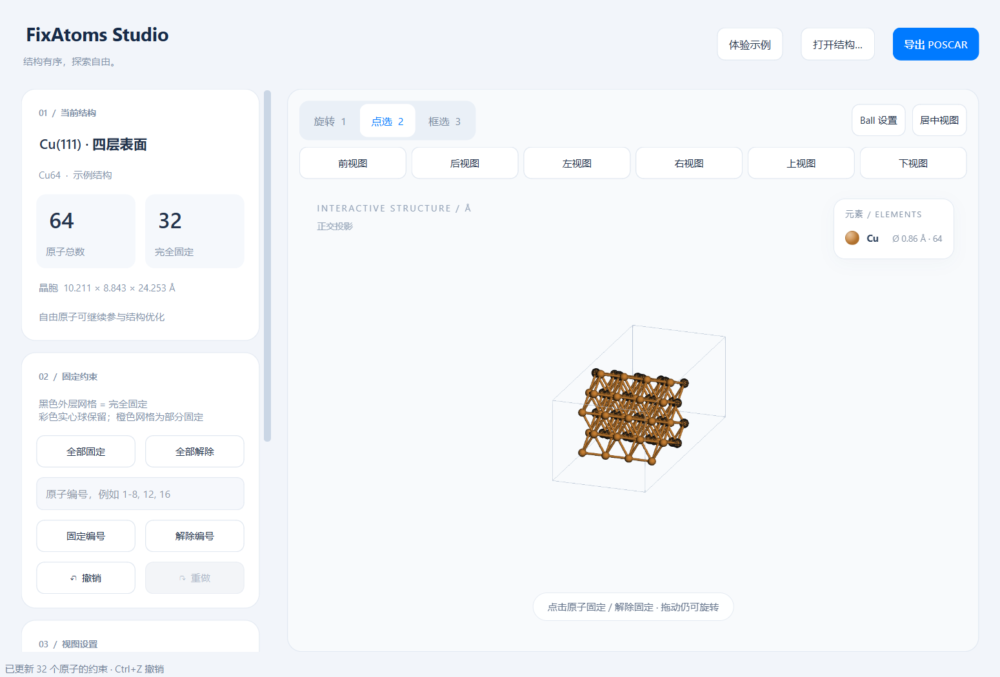
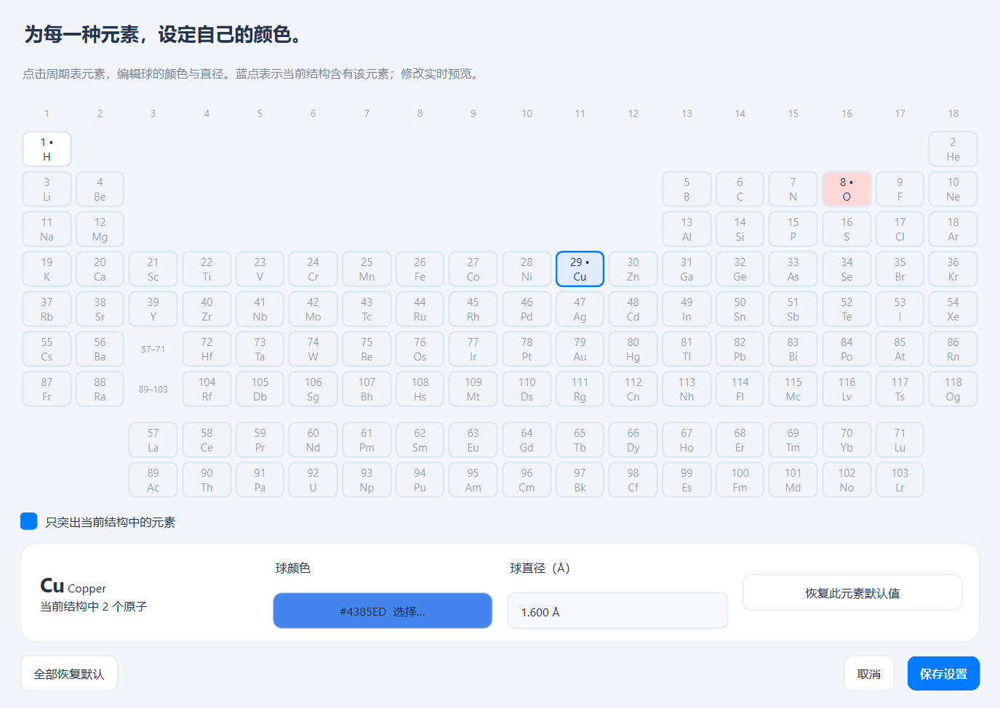
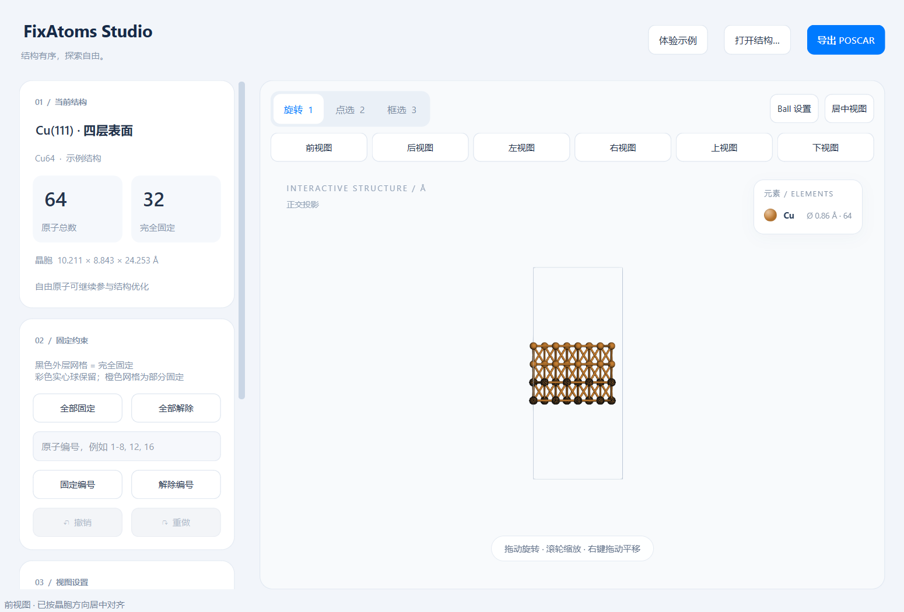
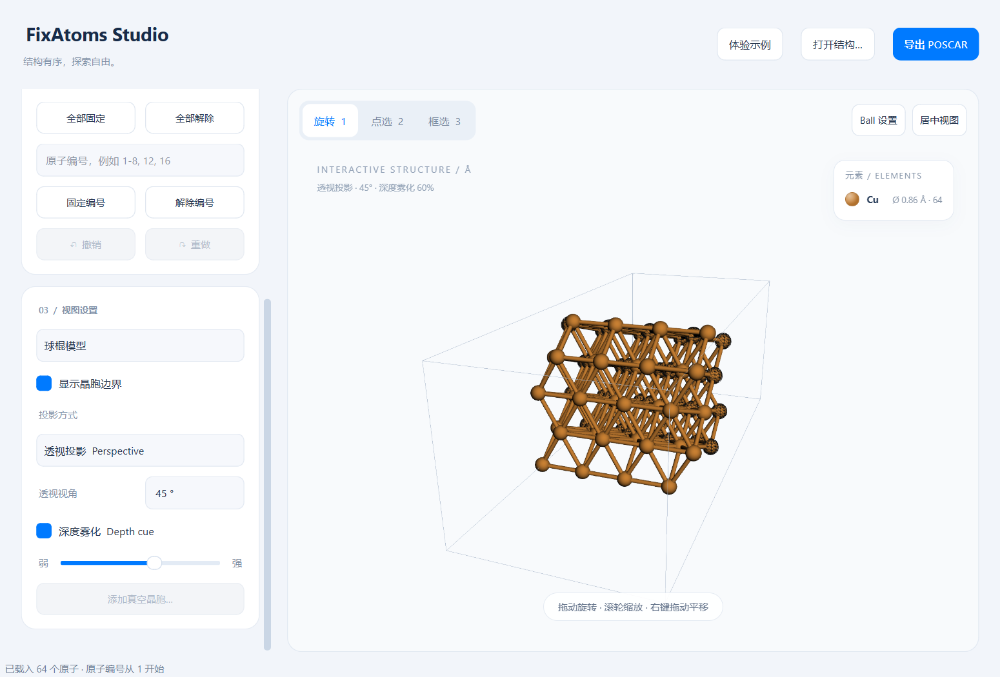
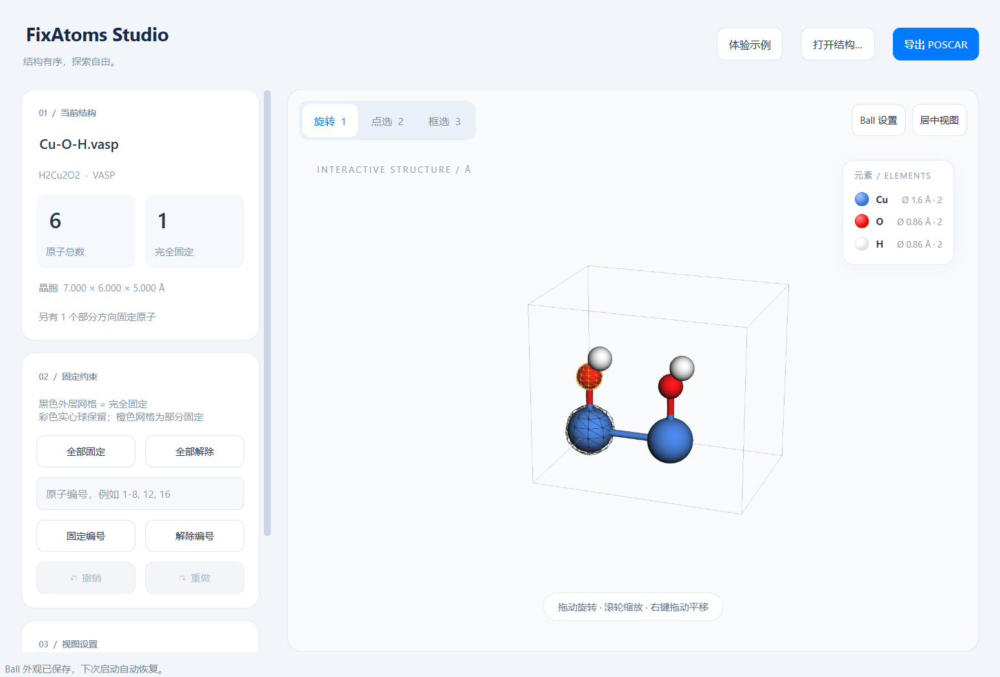

<div align="center">

# 🔬 FixAtoms Studio

**本地原子结构固定工具 · 纯离线 · 无联网依赖**

基于 **Python + PySide6 (Qt 6) + 3Dmol.js + ASE** 的桌面应用，用于可视化晶体结构并设置 VASP `Selective dynamics` 固定约束。

[](https://www.python.org/)
[](https://www.qt.io/)
[](https://wiki.fysik.dtu.dk/ase/)
[](https://github.com/3dmol/3Dmol.js)
[](https://github.com/moyulyy/fixatom)



*结构有序，探索自由。*

</div>

---

## ✨ 功能亮点

| 能力 | 说明 |
| --- | --- |
| 📥 多格式读取 | 支持 **CIF、POSCAR / CONTCAR、XSD**，统一只输出 **POSCAR** |
| 🖱️ 三种交互 | 旋转 / 点选 / 框选（`Shift` 反选），右键平移、滚轮缩放 |
| 🎯 直观约束标记 | 完全固定 = 彩色实心球 + **黑色网格球**；部分固定 = 橙色网格 |
| 🎨 元素外观定制 | 内置 118 元素周期表，可调颜色与球直径，偏好自动保存 |
| 🧭 六个标准视图 | 前 / 后 / 左 / 右 / 上 / 下，按真实晶胞向量对齐 |
| 📷 双投影 + 雾化 | 正交 / 透视投影、FOV 可调、深度雾化开关 |
| ↩️ 撤销重做 | 约束修改最多 100 步可撤销 |
| 🚀 离线便携 | 打包 EXE 开箱即用，本地 `3Dmol-min.js`，运行无需联网 |

## 🖼️ 界面预览

<div align="center">

| 主界面 | 元素周期表设置 |
| --- | --- |
|  |  |

| 标准视图 | 投影设置 |
| --- | --- |
|  |  |

| 自定义元素外观 |
| --- |
|  |

</div>

---

## 🚀 快速开始

### 方式一：EXE 便携版（推荐，无需安装任何环境）

打包输出位于 `dist/FixAtomsStudio/`，双击 **`FixAtomsStudio.exe`** 即可启动：

- 无需安装 Python、Conda、PySide6 或 ASE
- 目录内含运行依赖、本地 3Dmol.js、自定义图标、示例文件及使用说明
- 分享 / 迁移使用 `dist/FixAtomsStudio-Windows-x64-portable.zip`：**完整解压后运行 EXE**，保留同目录的 `_internal` 文件夹，不能单独取出 EXE
- 外观偏好 `ball_settings.json` 写入 EXE 同目录，迁移时随目录一并复制
- 适用于 Windows 10 / 11 64 位，需要系统支持 QtWebEngine / WebGL

### 方式二：从源码运行

已在本机 `D:\miniconda3\envs\chem_env` 验证：Python 3.11.15、PySide6 6.11.2、ASE 3.28.0。

```powershell
# 首次安装 / 补齐依赖
& 'D:\miniconda3\envs\chem_env\python.exe' -m pip install -r requirements.txt

# 启动空白窗口
& 'D:\miniconda3\envs\chem_env\python.exe' app.py

# 启动并显示 Cu(111) 四层表面（底部两层已固定）
& 'D:\miniconda3\envs\chem_env\python.exe' app.py --demo

# 直接打开文件
& 'D:\miniconda3\envs\chem_env\python.exe' app.py 'examples\Cu111.cif'
```

也可双击 **`run.bat`**（支持拖入结构文件打开，`run.bat --demo` 显示示例）。完整的 PySide6 包已包含 QtWebEngine，无需额外安装。

> 💡 推荐双击 **`FixAtoms Studio.lnk`** 以无终端窗口方式启动（自带图标）。更换环境或移动目录后运行 `.\create_shortcut.ps1` 重新生成。

---

## 📖 使用流程

1. **打开结构**：点击「打开结构…」或将单个结构文件拖入窗口，支持 `.cif`、`.xsd`、`.vasp`、`.poscar`、`POSCAR`、`CONTCAR`、`POSCAR_fixed` 等文件名。
2. **旋转查看**：旋转模式拖动旋转、滚轮缩放、右键平移；「居中视图」恢复居中。
3. **点选固定**：切到「点选」，点击原子切换完全固定 / 解除。完全固定原子保留彩色实心球并叠加 **1.12 倍直径的黑色网格球**。
4. **框选固定**：切到「框选」拖动矩形固定范围内原子；按住 **Shift** 拖动解除。框选按屏幕投影判断，包含被遮挡原子与所有深度。
5. **按编号操作**：输入 `1-8, 12, 16` 后点「固定编号」/「解除编号」。编号从 **1** 开始，与 ASE 读取顺序一致。
6. **导出 POSCAR**：点击「导出 POSCAR」选择位置，默认 `POSCAR_fixed`，始终输出 VASP POSCAR（不输出 CIF / XSD）。

其他操作：全部固定 / 全部解除、撤销 / 重做、球棍 / 空间填充 / 线框三种显示样式、晶胞边界开关、`F11` 全屏。

### ⌨️ 快捷键

| 快捷键 | 操作 |
| --- | --- |
| `Ctrl+O` | 打开结构 |
| `Ctrl+S` | 导出 POSCAR |
| `1` / `2` / `3` | 旋转 / 点选 / 框选 |
| `Esc` | 回到旋转模式，取消框选 |
| `F11` | 进入 / 退出全屏 |
| `Ctrl+Z` | 撤销约束修改 |
| `Ctrl+Shift+Z` / `Ctrl+Y` | 重做约束修改 |

---

## 🧭 投影、视图与外观

### 投影与深度

| 投影 | 效果 | 适用场景 |
| --- | --- | --- |
| 正交投影 Orthographic（默认） | 相同直径球不因远近改变尺寸，平行线保持平行 | 比较原子大小、查看晶胞和层状结构 |
| 透视投影 Perspective | 近大远小，更接近相机观察 | 查看立体关系和空间纵深 |

- **透视视角**（仅透视模式）：范围 `10–90°`，默认 `45°`，控制相机 FOV。
- **深度雾化 Depth cue**：两种投影下均可开启，滑块控制远处结构淡入背景的强度（0 为关闭）。

### 六个标准视图

按真实 `a、b、c` 晶胞向量计算（支持整体旋转的晶胞），点击按钮对齐朝向并居中适配，只旋转显示、不改坐标与约束：

| 按钮 | 与屏幕平行的晶面 | 水平方向 | 向上方向（屏幕 −y） |
| --- | --- | --- | --- |
| 前视图 | aOc | +a 向右 | +c 向上 |
| 后视图 | aOc | +a 向左 | +c 向上 |
| 左视图 | bOc | +b 向左 | +c 向上 |
| 右视图 | bOc | +b 向右 | +c 向上 |
| 上视图 | aOb | +a 向右 | +b 向上 |
| 下视图 | aOb | +a 向右 | +b 向上 |

> ⚠️ 当前需求对上 / 下视图方向定义相同，故这两个按钮使用相同朝向（按钮提示与状态栏会标明）。

### Ball 外观设置

点击视图顶部 **「Ball 设置」** 打开 118 元素周期表：点击元素调整颜色与球直径（`0.1–10 Å`），实时预览，保存后写入 `ball_settings.json`。右上角图例自动列出当前结构元素并同步颜色 / 直径 / 原子数。

- 默认配色采用 ASE 的 **Jmol** 方案
- 默认直径：球棍 `0.86 Å`、线框小球 `0.36 Å`、空间填充按范德华半径
- 自定义直径为实际显示直径，三种样式下均生效
- 外观设置只影响显示，不影响坐标、晶胞、约束或 POSCAR 输出

---

## 🧬 POSCAR 与约束处理

- ASE 负责读取三种格式、解析已有约束并写出 POSCAR；导出采用 `Selective dynamics`：完全固定 `F F F`，自由 `T T T`。
- 保留已有部分方向约束（如 `F T F`），以**橙色网格**标记；固定变完全固定、解除变完全自由，撤销可恢复。
- 部分约束遵循 VASP 晶格方向定义，由 ASE `FixScaled` 表示。
- 输出使用分数坐标 `Direct`，保留晶胞、原子顺序与位置，不排序、不折回晶胞、不合并相同元素组。
- 保存先写临时文件再原子替换，避免失败破坏现有输出。
- 对无完整晶胞的分子 XSD，先用「添加真空晶胞…」建立正交晶胞并居中，再允许导出。

---

## 📁 项目结构

```text
fixatom/
├── app.py                    # PySide6 窗口、QWebChannel、交互状态
├── structure_io.py           # ASE 读取、约束处理、POSCAR 导出
├── ball_settings.py          # 周期表外观设置、默认配色与偏好读取
├── camera_views.py           # 按晶胞方向计算六个标准视图的旋转
├── viewer.html               # 本地 3D 页面
├── viewer.js                 # 3Dmol 渲染、网格球、点选和框选
├── 3Dmol-min.js              # 本地 3Dmol.js 库（离线渲染）
├── requirements.txt          # 运行依赖
├── requirements-build.txt    # 打包依赖
├── run.bat                   # Windows 启动脚本
├── create_shortcut.ps1       # 重建带图标的启动快捷方式
├── FixAtomsStudio.spec       # PyInstaller 打包配置
├── assets/                   # 自定义 SVG / ICO / PNG 图标
├── tools/                    # build_icon.py、build_portable.py
├── examples/                 # Cu111.cif、Cu111.xsd、POSCAR_Cu111
├── docs/                     # 文档截图
└── tests/                    # I/O 与 GUI 自动化测试
```

---

## ✅ 验证

```powershell
# I/O 单元测试（无需窗口）
& 'D:\miniconda3\envs\chem_env\python.exe' -m unittest discover -s tests -v

# GUI 集成测试（需要桌面与 WebGL，短暂打开窗口）
& 'D:\miniconda3\envs\chem_env\python.exe' tests/gui_smoke.py
& 'D:\miniconda3\envs\chem_env\python.exe' tests/gui_appearance.py
& 'D:\miniconda3\envs\chem_env\python.exe' tests/gui_projection.py
& 'D:\miniconda3\envs\chem_env\python.exe' tests/gui_standard_views.py
```

- **I/O 测试**：CIF / XSD 转 POSCAR、非正交晶胞、原子顺序、完全 / 部分固定往返、无晶胞拒绝导出、跨周期边界不连长键。
- **GUI 测试**：真实鼠标点选 / 框选 / Shift 解除、撤销重做、编号操作、显示样式、全屏布局、周期表、投影与雾化、六标准视图方向及输出一致性。
- 便携包自检：`.\dist\FixAtomsStudio\FixAtomsStudio.exe --self-test '.\tests\artifacts\portable-check'`，写入 `report.json`、测试 POSCAR 与截图后退出。

---

## ⚠️ 实现与边界

- Python 保存唯一约束状态，经本地 QWebChannel 同步到 JavaScript；每次载入有独立编号，过期选择事件不会误应用。
- 使用原始浮点坐标与显式键连接创建 3Dmol 原子，不经过会截断精度的 PDB 中间格式；ASE 共价半径仅用于估算显示键，不影响 POSCAR 输出。
- 文件读取与显示数据准备在后台线程完成；大规模结构（数万原子）的渲染性能不做保证。
- 多帧 / 多数据块文件仅读取首帧 / 首个结构；CIF 对称展开与 XSD 支持范围取决于 ASE。
- 该工具导出几何结构与选择性动力学约束，不承诺保留原 POSCAR 注释、速度段、预测校正数据或第三方专有元数据；不支持的 ASE 约束类型会报错而非静默丢弃。
- 需要系统支持 QtWebEngine / WebGL；若远程桌面或显卡驱动导致空白视图，请更新驱动或在本机桌面启动。不要直接用浏览器打开 `viewer.html`，它需要 Python 提供 QWebChannel。
- `3Dmol-min.js` 为第三方库，使用与再分发需遵守其上游许可：[3Dmol.js 项目](https://github.com/3dmol/3Dmol.js)。

---

<div align="center">

**FixAtoms Studio** · 让固定原子变得简单直观

<sub>Built with Python · PySide6 · ASE · 3Dmol.js</sub>

</div>
